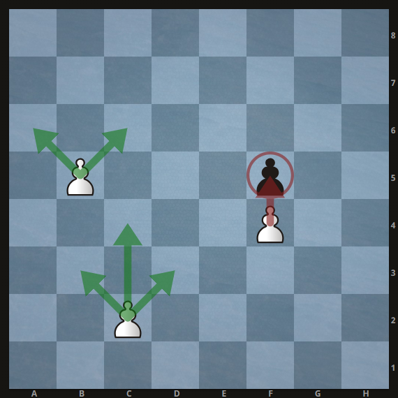

# AposChess
A chess variant that might or might not be fun.

## Index

* [Pawn](#pawn)
* [Bishop](#bishop)
* [Knight](#knight)
* [Rook](#rook)
* [Queen](#queen)
* [King](#king)
* [Example Start 01](#example-start-01)

## Piece Movements

### Pawn

The pawn can move diagonally. It takes forward. On the first move, it can move forward two spaces.

### Bishop

The bishop moves normally. Additionally, it can jump over a piece without taking it. It has to stop on the next square. It can take a piece on that next square if there is one.

### Knight

The knight can no longer jump over pieces. He moves like a rook then one to the side.

The following move is invalid since it is blocked by the pawn:

### Rook

The rook moves normally. Additionally, it can jump over a piece without taking it. It has to stop on the next square. It can take a piece on that next square if there is one.

### Queen

The queen moves normally. The queen also has a 3x3 zone around itself. A jumping piece cannot end up in that zone after a jump.

### King

The king moves normally. The king also has a 3x3 zone around itself. A jumping piece cannot end up in that zone after a jump.

### Example Start 01

The following is an example attack on the black rook starting from the first move.

Black has four different defenses:

